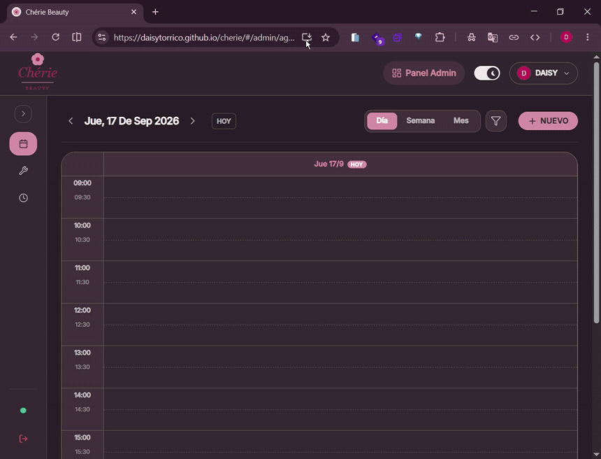

# Chérie Beauty

[](https://react.dev/)
[](https://www.typescriptlang.org/)
[](https://vitejs.dev/)
[](https://tailwindcss.com/)
[](https://firebase.google.com/)
[](https://web.dev/progressive-web-apps/)

PWA para salón de belleza que incluye reserva de turnos para clientes y panel de administración con agenda.

## Funcionalidades

### Clientes
- **Catálogo de servicios:** Precios, duración y filtrado por categoría.
- **Reserva de turnos:** Selección de servicios individuales o combinados con cálculo automático de horarios disponibles.
- **Cancelaciones:** Cancelación directa desde la app (hasta 48 hs antes) o derivación a WhatsApp.
- **Favoritos y calendario:** Guardado de servicios en lista de deseos y sincronización con Google Calendar.
- **Cuentas:** Registro con Google o correo para ver turnos agendados y pasados.

### Administración

<p align="center">
  
</p>

- **Agenda:** Vistas por día, semana y mes con turnos manuales y bloqueos de horario.
- **Historial de clientes:** Registro de citas anteriores y notas internas por cliente.
- **Servicios y categorías:** ABM con reordenamiento drag & drop y subida de imágenes.
- **Promociones:** Banners con descuentos temporales.
- **Configuración:** Días y horarios de atención, modo mantenimiento y personalización de portada.
- **WhatsApp:** Mensajes prearmados para confirmar o cancelar turnos con un clic.

## Stack

| Capa | Tecnologías |
|---|---|
| Frontend | React 19, TypeScript, Vite 8, Tailwind CSS v4, Motion |
| Backend / DB | Cloud Firestore |
| Autenticación | Firebase Auth (Google OAuth y Email/Password) |
| Multimedia | Cloudinary |
| PWA | vite-plugin-pwa, Workbox |
| Testing | Vitest, React Testing Library |

## Instalación y uso

```bash
# Clonar e instalar
git clone https://github.com/daisytorrico/cherie.git
cd cherie
npm install

# Iniciar en desarrollo
npm run dev

# Tests y build
npm test
npm run build
```