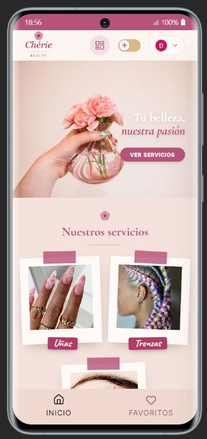
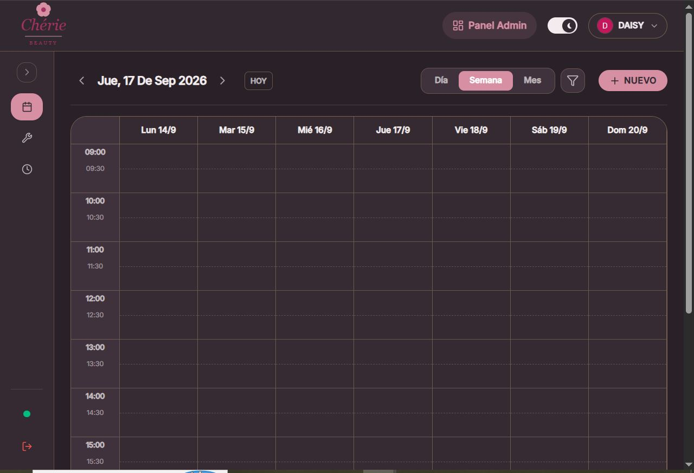

# Chérie Beauty — Salón Boutique & Agenda de Turnos

[](https://react.dev/)
[](https://www.typescriptlang.org/)
[](https://vitejs.dev/)
[](https://tailwindcss.com/)
[](https://firebase.google.com/)
[](https://web.dev/progressive-web-apps/)

> Aplicación web progresiva (PWA) para catálogo de servicios y gestión de turnos de un salón de belleza. Diseñada mobile-first con estética editorial, arquitectura modular y disponibilidad en tiempo real.

---

&nbsp;&nbsp;&nbsp;&nbsp;

---

## Características

- **Catálogo de servicios** con imágenes, precios y tiempos estimados, organizado por categorías.
- **Reserva inteligente** con carrito multi-servicio, cálculo automático de duración total y selección de horario disponible.
- **Motor de disponibilidad** que previene solapamientos en tiempo real usando transacciones atómicas de Firestore.
- **Política de cancelación** automática (directa si restan +48h; por WhatsApp si el plazo es menor).
- **Lista de favoritos** y sincronización de citas con Google Calendar.
- **Panel de administración** con agenda semanal/mensual, ABM de servicios y categorías con drag-and-drop, y creación manual de turnos.
- **Configuración de disponibilidad** por día, con soporte de pausas y días no laborables.
- **PWA offline-first** instalable en móvil y escritorio, con caché de assets y fuentes vía Workbox.

---

## Stack

| Capa | Tecnologías |
|---|---|
| **Core** | React 19, TypeScript, Vite 8 |
| **Estilos** | Tailwind CSS v4, Motion (Framer Motion) |
| **Base de datos** | Cloud Firestore |
| **Autenticación** | Firebase Auth (Google OAuth) |
| **Imágenes** | Cloudinary REST API |
| **PWA** | vite-plugin-pwa, Workbox |
| **Routing** | React Router DOM v7 (HashRouter) |
| **Testing** | Vitest, React Testing Library |

---

## Puesta en marcha

```bash
# 1. Clonar e instalar
git clone https://github.com/daisytorrico/cherie.git
cd cherie
npm install

# 2. Desarrollo
npm run dev

# 3. Tests y build
npm test
npm run build
```